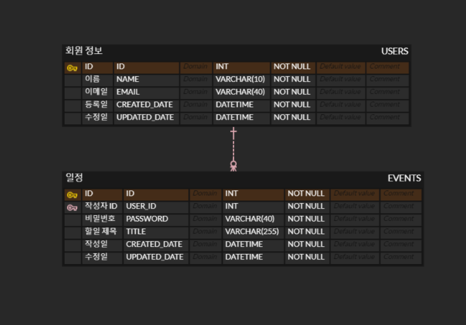

# MyCalendar

## 주요 기능

## API 명세

### 일정 등록
- Method : POST
- URI:/events
- Request
  - PathVariable : 없음
  - RequestBody :
  
    |     | 이름       | 타입     | 필수여부 | 설명      |
    | --- | -------- | ------ | ---- | ------- |
    | 1   | name     | String | 필수   | 사용자 이름  |
    | 2   | password | String | 필수   | 일정 비밀번호 |
    | 3   | title    | String | 필수   | 일정 제목   |

- Response
  200 ok
- Exception (Response Header) :

    | 에러 코드 | 에러 메세지                 |
    | ----- | ---------------------- |
    | 400   | 필수 필드 누락 또는 잘못된 요청입니다. |

### 일정 단건 조회
- Method : GET
- URI:/events/{id}
- Request
    - PathVariable :

      |     | 이름 | 타입   | 필수여부 | 설명     |
      | --- |----|------|------| ------ |
      | 1   | id | Integer | 필수   | 일정 식별자 |
    - RequestBody : 없음
- Response

  |     | 이름           | 타입       | 설명     |
  | --- | ------------ |----------| ------ |
  | 1   | id           | Integer     | 일정 식별자 |
  | 2   | name         | String   | 작성자 이름 |
  | 3   | title        | String   | 일정 제목  |
  | 4   | created_date | Datetime | 생성 일시  |
  | 5   | updated_date | datetime | 수정 일시  |
- Exception (Response Header) :

  | 에러 코드 | 에러 메세지                 |
  | ----- | ---------------------- |
  | 404   | 리소스를 찾을 수 없습니다.        |

### 일정 목록 조회
- Method : GET
- URI:/events
- Request
    - PathVariable : 
- RequestBody :  

  |   | 이름           | 타입     | 필수여부 | 설명     |
  |---|--------------| ------ |------|--------|
  | 1 | name         | String | 선택   | 사용자 이름 |
  | 2 | updated_date | Datetime | 선택   | 수정 일시  |

- Response
  
  |     | 이름(depth 1) | 이름 (Depth 2) | 타입                 | 설명     |
  | --- | ----------- | ------------ |--------------------| ------ |
  | 1   | EventList   |              | Map<Integer,Event> | 일정 리스트 |
  | 2   |             | id           | Integer               | 일정 식별자 |
  | 3   |             | name         | String             | 작성자 이름 |
  | 4   |             | title        | String             | 일정 제목  |
  | 5   |             | created_date | Datetime           | 생성 일시  |
  | 6   |             | updated_date | Datetime           | 수정 일시  |
- Exception (Response Header) :

  | 에러 코드 | 에러 메세지                 |
  | ----- | ---------------------- |  
  | 400   | 필수 필드 누락 또는 잘못된 요청입니다. |
  | 404   | 리소스를 찾을 수 없습니다.        |

### 일정 수정
- Method : PUT
- URI:/events/{id}
- Request
    - PathVariable :
  
      |     | 이름    | 타입   | 필수여부 | 설명     |
      | --- | ----- |------| ---- | ------ |
      | 1   | id    | Integer | 필수   | 일정 식별자 |
    - RequestBody :
  
      |   | 이름       | 타입     | 필수여부 | 설명      |
      |---|----------| ------ |------|---------|
      | 1 | name     | String | 선택   | 사용자 이름  |
      | 2 | password | String | 필수   | 일정 비밀번호 |
      | 2 | title    | String | 선택   | 일정 제목   |

- Response
  200 ok
- Exception (Response Header) :

  | 에러 코드 | 에러 메세지                 |
  | ----- | ---------------------- |
  | 400   | 필수 필드 누락 또는 잘못된 요청입니다. |
  | 404   | 리소스를 찾을 수 없습니다.        |

### 일정 삭제
- Method : POST
- URI:/events/{id}
- Request
    - PathVariable :
  
      |     | 이름  | 타입  | 필수여부 | 설명     |
      | --- | --- |-----| ---- | ------ |
      | 1   | id  | int | 필수   | 일정 식별자 |

    - RequestBody :
      
      |     | 이름       | 타입     | 필수여부 | 설명      |
      | --- | -------- | ------ | ---- | ------- |
      | 1   | password | String | 필수   | 일정 비밀번호 |

- Response
  200 ok
- Exception (Response Header) :

  | 에러 코드 | 에러 메세지                 |
  | ----- | ---------------------- |
  | 400   | 필수 필드 누락 또는 잘못된 요청입니다. |
  | 404   | 리소스를 찾을 수 없습니다.        |

### 공통 에러코드
| 에러 코드 | 에러 메세지                 |
| ----- | ---------------------- |
| 500   | 서버 에러입니다               |

## ERD

